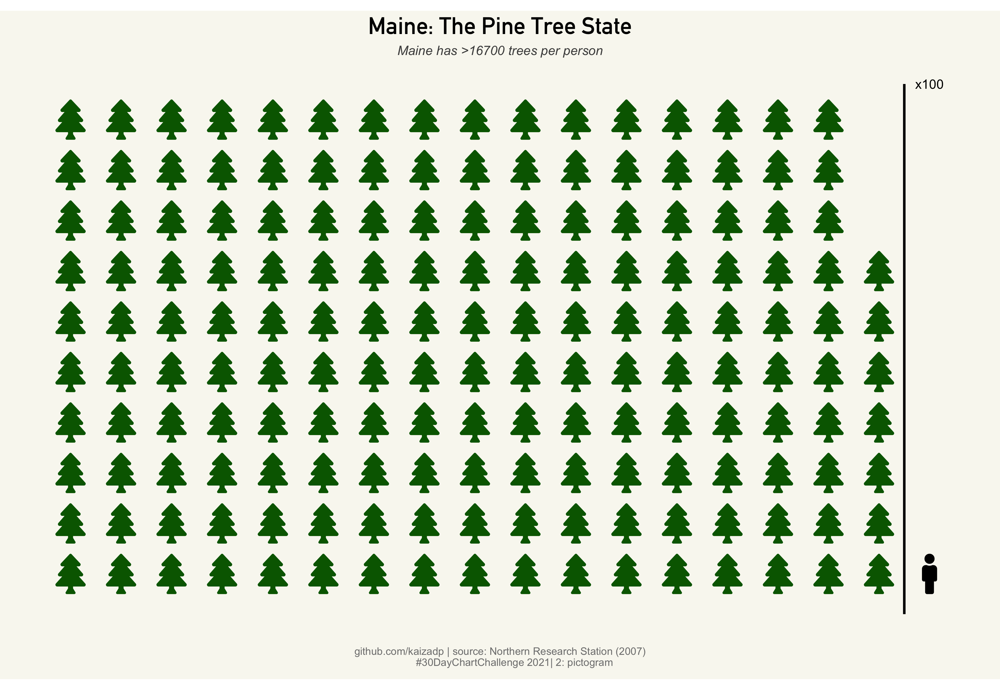
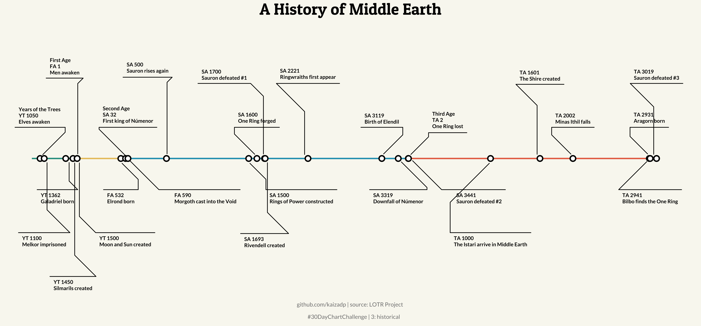

# 30DayChartChallenge

DataViz challenge for April 2021.

Check out [Z3tt/30DayChartChallenge_2021](https://github.com/Z3tt/30DayChartChallenge_2021) and [#30DayChartChallenge](https://twitter.com/30DayChartChall) for more info.

---

### 1: part-to-whole

### 2: pictogram

### 3: historical

### 4: magical

